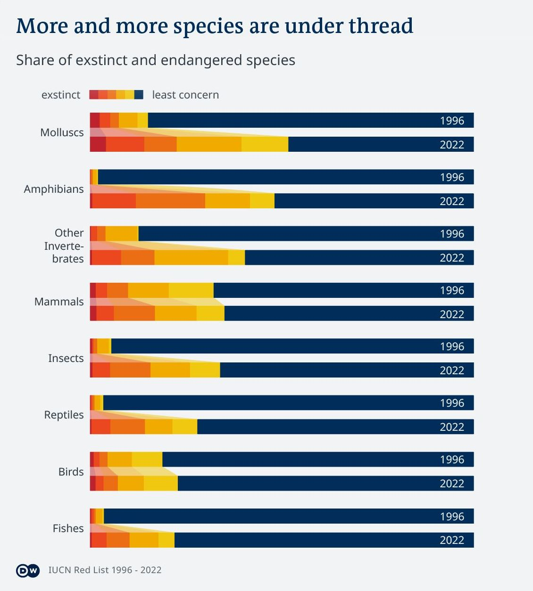

# Species Conservation

_Idea:_  [Michel Penke](https://michelpenke.de)\
_Research, data analysis and data visualization:_  [Julia Merk](https://www.linkedin.com/in/julia-merk-b61120157/?originalSubdomain=de), [Michel Penke](https://michelpenke.de)\
_Writing:_  [Michel Penke](https://michelpenke.de)

**Read the full articles on DW.com:**
- [XXX](XXX)

Humans are currently causing the sixth mass extinction of plant and animal species. But some populations are growing against the trend. The reason: good conservation measures. What works in species conservation - and what doesn't.
Not all species face extinction, but biodiversity loss impacts ecosystems. 

The following text will explain the process behind this story: Which data sources were used, how the analysis was conducted and how the data was visualized.

# Source data

| **Data** | **Source** | **Link** |
| --- | --- | --- |
| 1996 IUCN Red List of Threatened Animals | IUCN | [Data](https://portals.iucn.org/library/sites/library/files/documents/RL-1996-001.pdf) |
| Summary Statistics | IUCN | [Data](https://www.iucnredlist.org/resources/summary-statistics)|
| Number of species in each IUCN Red List Category by kingdom and class | IUCN | [Data](https://www.iucnredlist.org/statistics/)|
| IUCN Red List Database (Green Status Assessment Information) | IUCN | [Data](https://www.iucnredlist.org/)|
| Environmental Protection Expenditures | IMF | [Data](https://climatedata.imf.org/datasets/d22a6decd9b147fd9040f793082b219b/explore)|
| IUCN Red List Index | IUCN | [Data](https://www.iucnredlist.org/assessment/red-list-index)|
| UNECE Red List Index | UNECE | [Data](https://w3.unece.org/PXWeb2015/pxweb/en/STAT/STAT__92-SDG__01-sdgover/015_en_sdGoal15_r.px/table/tableViewLayout1/)|

# Analysis
### Share of threatened species

The first graph shows the proportion of species by class and kingdom that are exposed to different levels of threat. The scale ranges from species that do not suffer from human intervention in the ecosystem to species that are on the brink of extinction or are already extinct.

The classification is based on that of the IUCN, but has been simplified for the sake of comprehensibility. Thus, species that are extinct and species that are extinct (only) in the wild have been classified as extinct, similar to the IUCN subcategory. The same applies to species that are critically endangered and merely endangered. Species that are only at low risk but depend on species conservation, as well as near threatened species, have also been grouped together. Species for which no data were available were removed from the total pool and the remaining species were counted as 100 per cent.

As the classification of species by class and kingdom was not the same in the period 2016-2022, corrections had to be made manually. The classification can be reproduced [here](https://deutschewelle-my.sharepoint.com/:x:/g/personal/michel_penke_dw_com/ET0C-3R_7VBKlj4WuIIu9XcBjKxlRZWikQvF1fBE0NsZzQ?e=fnHBA8).

_Caveats: As not all species and their endangerment status are known, the results are only an approximation of reality. The real proportion of endangered species is not known. Furthermore, the assessment of a species as extinct usually takes several decades, as no more representatives of the species have to be sighted over a longer period of time to assume that the species has disappeared. Consequently, the proportion of species categorized as extinct is expected to be systematically too low._

### Recovery score of selected species

The data were taken from the Green Status Assessment Information of the IUCN Red List Database. The scale ranges from 100 percent (=full recovery) to 0 percent (=exstinct). However, data are only available for some species.
  

Four data points per species were visualised. The full recovery level indicates the value to which the species can optimally recover within 100 years. The second, what level it can reach within 10 years if all current conservation measures are maintained. The third, where the species would be in 10 years if all conservation measures were suspended. And the last, how the species would be doing if no conservation measures had ever been taken.

_Caveats: The data comes from the subjective assessment of experts who have included certain objective assessments in their evaluation. For example, how much of the originally populated habitats can still or in the future be inhabited by the species. Nevertheless, their assessment is subject to a certain degree of subjectivity._

### Share of environment protection spending

The data in the third chart are from an IMF survey and were collected in the national currency.

_Caveats: The greatest uncertainty here is what exactly was classified as state-financed environmental protection. For example, are costs incurred in recycling waste already capital to be understood as environmental protection investments, even though they only reduce additional pollution? A narrower definition was chosen for the analysis, which does not include, for example, expenditure on the reprocessing of waste and wastewater. The IMF uses the term 'expenditure on environment protection' for this category._

### Expenditures and success

In order to visualise whether there is a correlation between the share of environmental protection expenditure as a share of GDP and the success of species conservation, the Red List Index was used.

The [RLI](https://www.iucnredlist.org/assessment/red-list-index) shows 'trends in overall extinction risk for species, and is used by governments to track their progress towards targets for reducing biodiversity loss'. However, the index is not available for all animal genera. Currently, the RLI is available for five taxonomic groups only. These include birds, mammals, amphibians, cycads and warm-water reef-forming corals. For an assessment of national development, the RLI is weighted according to the species known there.

You can follow the detailed analysis on RLI change [here](https://deutschewelle-my.sharepoint.com/:x:/g/personal/michel_penke_dw_com/ET0C-3R_7VBKlj4WuIIu9XcBjKxlRZWikQvF1fBE0NsZzQ?e=fnHBA8). 

_Caveats: However, as not all species have been scientifically recorded, the weighting is very likely subject to bias. Accordingly, the RLI is also likely to be only an approximation of the actual state of biodiversity loss in the respective countries._